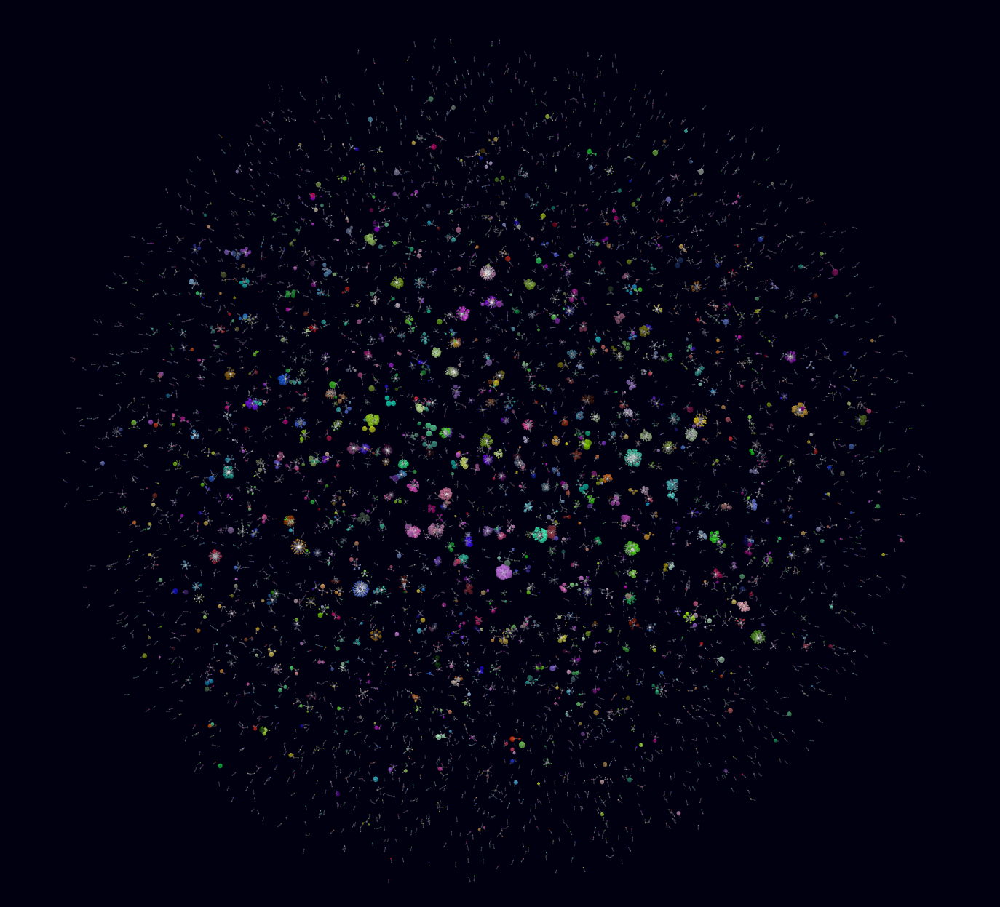

# Spotify Universe Generator
This is a system for users to upload their *extended listening data* (which can be found [here](https://www.spotify.com/us/account/privacy/))  - **Make sure you get "Your Extended streaming history"**

After uploading songs and artists will be displayed as nodes. Each artist branches out to each of its songs, with shared songs having multiple links to each song, not multiple nodes.
Hovering over an artist node will display the name of the artist as well as the total song count linked '*ex: Taylor Swift (15)*' to them. Hovering over a song will display how many times it has been played '*ex: Shake It Off (45)*' the size of the node also changes with larger nodes having more plays.

After uploading, stats will be shown about all the data including, *Total Listen Time, Number of Unique Songs, Number of Unique Artists, Top Artists based on Listen Time, Top Artists based on Song Count, and Top Songs based on Play Count*.

## Example
